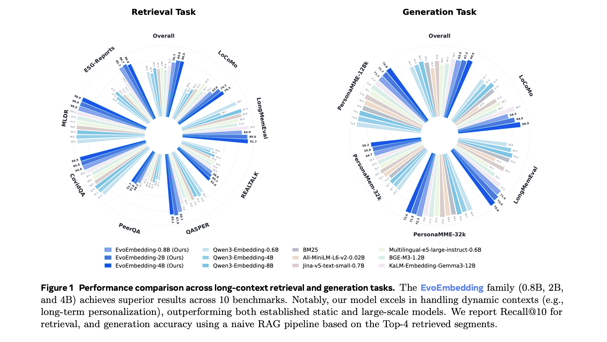
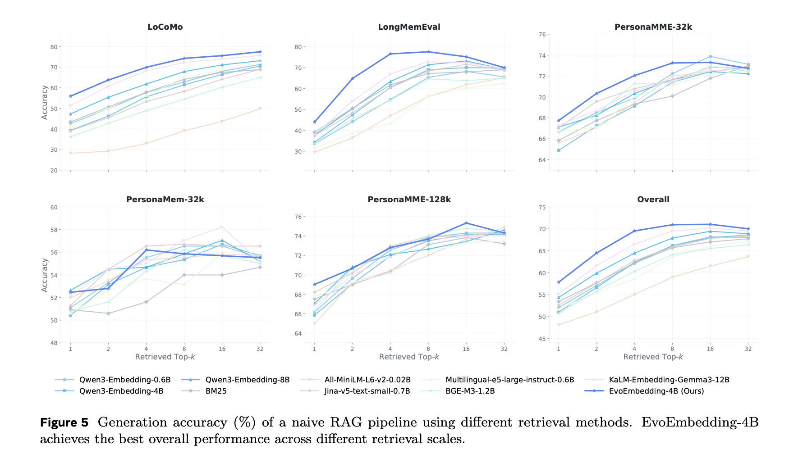
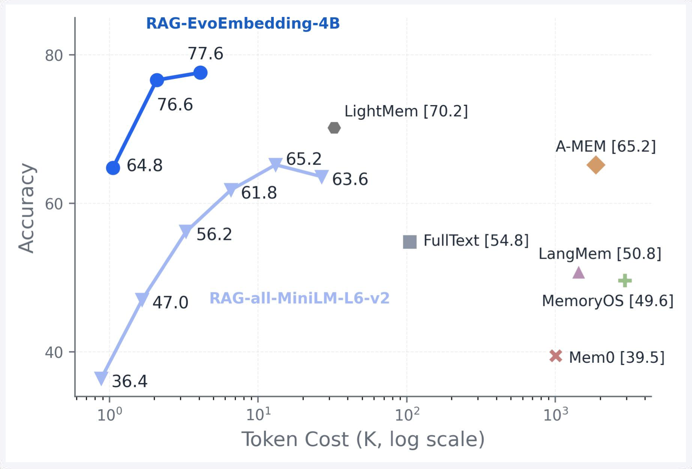
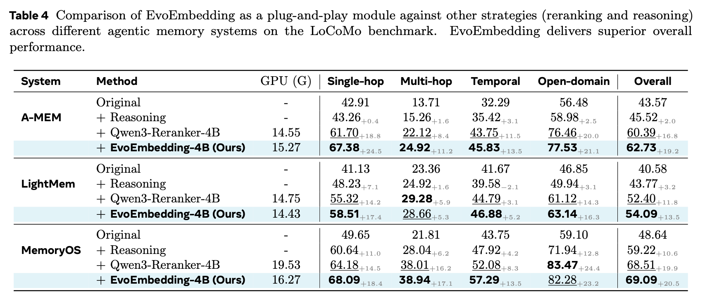
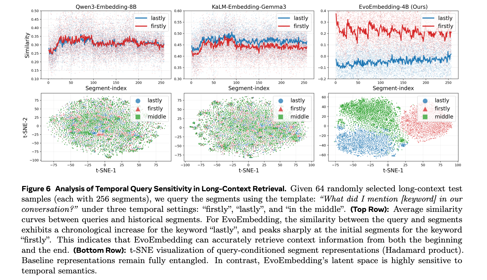

<p align="center">
  
</p>

<div align="center">

<a href="https://github.com/Clare-Nie/EvoEmbedding">
  
</a>
<a href="https://arxiv.org/abs/0000.00000">
  
</a>
<a href="https://huggingface.co/ClareNie/EvoEmbedding-4B">
  
</a>
<a href="https://huggingface.co/datasets/ClareNie/EvoEmbedding-Dataset">
  
</a>

</div>

---

**EvoEmbedding = Native Memory + Latent Embedding**

Instead of encoding text segments into isolated static vectors, EvoEmbedding sequentially processes the input stream, continuously updates a **Latent Memory Queue**, and jointly generates context-aware, **Evolvable Embeddings** for precise long-context retrieval. 

## Contents

- [Framework](#framework)
- [Dataset](#dataset)
- [Conclusions](#conclusions)
- [Quick Start](#quick-start)
- [Repository Structure](#repository-structure)
- [Citation](#citation)

## Framework
<p align="center">
  
</p>

Existing embedding models are inherently static: they encode text segments in isolation, ignoring their surrounding context and temporal order. **EvoEmbedding** is a novel embedding model that generates \textit{evolvable} representations for retrieval.It maintains a continuously updated latent memory as it sequentially processes inputs, and uses it alongside the raw content to jointly generate evolvable embeddings.

At each step, the model coordinates two decoupled, parallel operations to process incoming text segments:

- 🧠 **Memory Evolution:** Automatically compresses the current text segment and fuses it with previous native memory, pushing the updated state into a bounded FIFO **Latent Memory Queue**. This ensures continuous state tracking without massive memory overhead.
- ✨ **Representation Generation:** Dynamically combines the historical latent memory with the raw input segment to generate context-aware, **Evolvable Embeddings**. The resulting representations are highly sensitive to chronological order and semantic shifts.


## Dataset

The released **EvoTrain-180K** dataset uses an intuitive, chat-style fine-tuning format designed for joint SFT (Supervised Fine-Tuning) and retrieval optimization. 

### Data Structure

Each training instance is a self-contained context window structured with the following key components:

- `messages`: Standard alternating user/assistant turns representing the SFT generation target.
- `meta.turns`: Formatted turn-level strings (concatenating User and Assistant messages) processed sequentially by the retriever path to simulate dynamic context streaming.
- `meta.evidence_turns`: Zero-based indices pointing to the specific historical turn(s) containing the ground-truth evidence (serving as positive targets $v^+$ for contrastive loss).

Here is a representative structural example (intermediate context omitted for brevity):

```json
{
    "messages": [
        {
            "role": "user",
            "content": "[Target Evidence] I’m a retired cop... Any good local diners? No seafood, please."
        },
        {
            "role": "assistant",
            "content": "Try Mama’s Diner on Main St. No seafood on the menu."
        },
        
        ... (Multiple irrelevant dialogue turns / long context chunks omitted) ...
        
        {
            "role": "user",
            "content": "[Query] What type of restaurant did I say not to recommend earlier?"
        },
        {
            "role": "assistant",
            "content": "[Ground-truth Answer] Seafood."
        }
    ],
    "meta": {
        "evidence_turns": [
            0
        ],
        "turns": [
            "User: [Target Evidence] I’m a retired cop... Any good local diners? No seafood, please.\nAssistant: Try Mama’s Diner on Main St. No seafood on the menu.",
            "... (Multiple irrelevant dialogue turns / long context chunks omitted) ...",
            "[Query] What type of restaurant did I say not to recommend earlier?"
        ]
    }
}
```

### Training on Custom Datasets

Our JSON schema makes it **straightforward to adapt EvoEmbedding to your custom data**, whether it's document QA, customer support logs, or specialized RAG databases.

To construct your own training data, simply follow these 3 steps:
1. **Chunk your context:** Map your document chunks, paragraphs, or chat turns sequentially into the `meta.turns` list.
2. **Label the evidence:** Identify which chunk(s) contain the answer and put their index into `meta.evidence_turns`.
3. **Set the objective:** Place the final query at the end of `meta.turns`, and ensure the `messages` array reflects the full context sequence ending with the assistant's correct response.

This design bypasses the need for complex vector-database setups during training. Our SFT pipeline natively consumes this format, allowing you to easily fine-tune the model to track dynamic states and retrieve accurately in your proprietary domain.

## Conclusions

### 1. State-of-the-Art Retrieval Performance
EvoEmbedding achieves superior results across 10 benchmarks, outperforming established static and larger-scale specialist models (such as Qwen3-Embedding-8B and KaLM-Embedding-Gemma3-12B) with smaller parameter sizes.

<p align="center">
  
</p>
<p align="center">
  
</p>

### 2. Naive RAG Powered by EvoEmbedding Surpasses Dedicated Agentic Memory
A standard naive RAG pipeline using EvoEmbedding-4B outperforms complex, dedicated agentic memory architectures (such as Mem0 and MemoryOS) while requiring no explicit memory construction token overhead at test time.

<p align="center">
  
</p>

### 3. Plug-and-Play Compatibility with Agentic Workflows
EvoEmbedding is highly compatible as a drop-in replacement. Integrating it into existing baseline frameworks (like A-MEM and LightMem) yields substantial performance gains (+19.2% and +13.5% respectively) without modifying the core generative LLMs.

<p align="center">
  
</p>

### 4. Temporal retrieval capabilities.
Unlike static embeddings that suffer from representation entanglement in long histories, EvoEmbedding's latent space is highly sensitive to chronological order. It successfully decouples temporal intents, excelling at queries constrained by temporal keywords (such as "firstly" and "lastly").

<p align="center">
  
</p>

## Quick Start

### Environment

Use the matching environment and dependency file for the model family you want to run.

| Model size | Conda env | Requirements |
| --- | --- | --- |
| EvoEmbedding-0.8B / EvoEmbedding-2B | `evoemb` | `requirements-evoembedding-lite.txt` |
| EvoEmbedding-4B | `evoemb` | `requirements-evoembedding-4b.txt` |

```bash
conda activate evoemb
pip install -r requirements-evoembedding-lite.txt
```

For the 4B model family:

```bash
conda activate evoemb
pip install -r requirements-evoembedding-4b.txt
```

Recommended runtime:

- Python 3.10+
- PyTorch with CUDA support
- BF16-capable GPU

### Usage

`model/client.py` exposes both the dense embedding helper and the EvoEmbedding reranker interface.

#### Embedding Model

```python
import numpy as np

from model.client import get_text_embedding

history_turns = [
    "I visited Paris in April.",
    "I bought a new laptop yesterday.",
    "The meeting was moved to Friday.",
]
query = "Where did I travel in spring?"

query_emb = get_text_embedding(
    query,
    model_name="Qwen/Qwen3-Embedding-0.6B",
    is_query=True,
)
doc_embs = get_text_embedding(
    history_turns,
    model_name="Qwen/Qwen3-Embedding-0.6B",
)

scores = np.matmul(query_emb, doc_embs.T)[0]
ranked_indices = np.argsort(-scores).tolist()
```

#### EvoEmbedding Reranker

```python
from model.client import EvoEmbeddingClient

messages = [
    {"role": "user", "content": "I visited Paris in April."},
    {"role": "assistant", "content": "Noted."},
    {"role": "user", "content": "I also bought a new laptop yesterday."},
    {"role": "assistant", "content": "Got it."},
    {"role": "user", "content": "Where did I travel in spring?"},
]

client = EvoEmbeddingClient(
    model_path="ClareNie/EvoEmbedding-4B",
    tokenizer_name="Qwen/Qwen3-4B-Instruct-2507",
)

ranked_turn_indices = client.send_message_retrieve(
    messages,
    rag_sentence_num=2,
    _sorted=False,
)
```

The embedding example returns vectors for downstream scoring. `send_message_retrieve` returns ranked history indices directly. Index `0` refers to the first user-assistant history turn in `messages[:-1]`.

### Training

Train the model size with its matching base model and dependency file:

```bash
conda activate evoemb
pip install -r requirements-evoembedding-4b.txt
PYTHONPATH=. torchrun --nproc_per_node=8 train/train.py \
  --dataset_name ClareNie/EvoEmbedding-Dataset \
  --base_model Qwen/Qwen3-4B-Instruct-2507 \
  --output_dir ./output/evoembedding-4b
```

For the 0.8B and 2B variants, use `evoemb` with `requirements-evoembedding-lite.txt` and replace `--base_model` and `--output_dir` with the corresponding model paths.

### Evaluation

Run a single benchmark:

```bash
PYTHONPATH=. python eval/eval.py \
  --eval_method rag \
  --model_name EvoEmbedding \
  --eval_bench locomo \
  --rag_sentence_num 16 \
  --embedding_model Qwen/Qwen3-Embedding-0.6B
```

Run the batch evaluation script:

```bash
PYTHONPATH=. bash eval/eval.sh
```

The current evaluation entrypoint keeps the following benchmarks:

- `locomo`
- `longmemeval_s`
- `personamem32`
- `PersonaMME32`
- `PersonaMME128`

## Repository Structure

```text
EvoEmbedding/
├── model/              # model implementation and client
├── train/              # training entrypoint
├── eval/               # evaluation scripts
├── docs/               # project page and visual assets
├── requirements-evoembedding-4b.txt
└── requirements-evoembedding-lite.txt
```

## Notes

- This repository does not include benchmark data.
- The Hugging Face model repo contains inference files only.
- Evaluation scripts expect benchmark data under `./data/`.

## Citation

```bibtex
@article{nie2026evoembedding,
  title={Evolvable Embedding for Long-Context Retrieval},
  author={Nie, Chang and Fu, Chaoyou and Shan, Caifeng},
  journal={arXiv preprint},
  year={2026}
}
```