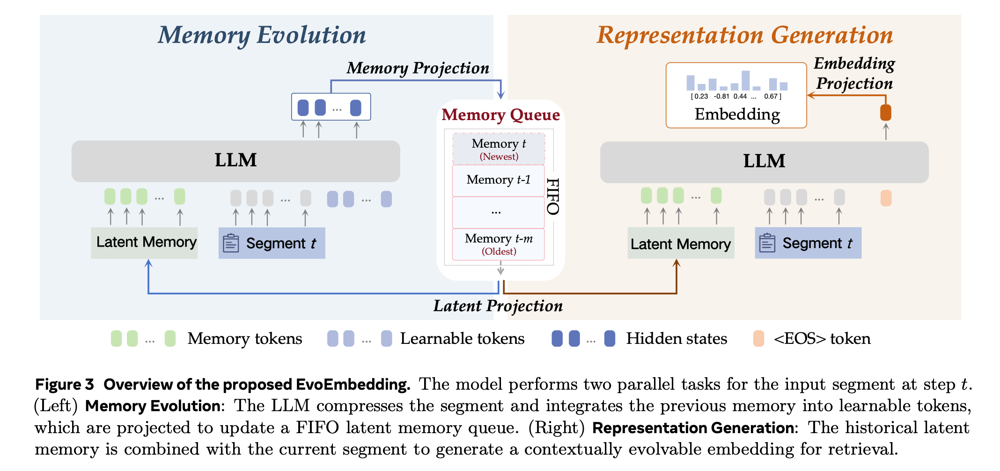
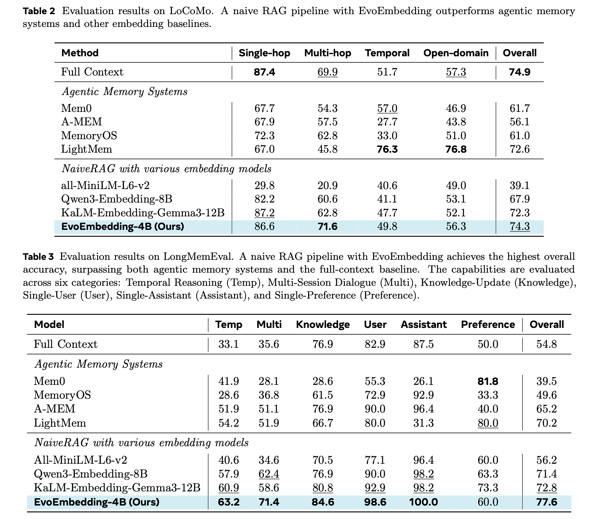

<p align="center">
  
</p>

<div align="center">

<a href="https://github.com/Clare-Nie/EvoEmbedding">
  
</a>
<a href="https://arxiv.org/abs/0000.00000">
  
</a>
<a href="https://huggingface.co/ClareNie/EvoEmbedding-4B">
  
</a>
<a href="https://huggingface.co/datasets/ClareNie/EvoEmbedding-Dataset">
  
</a>

</div>

---

**EvoEmbedding = Native Memory + Latent RAG**

Instead of encoding text segments into isolated static vectors, EvoEmbedding sequentially processes the input stream, continuously updates a **Latent Memory Queue**, and jointly generates context-aware, **Evolvable Embeddings** for precise long-context retrieval. 

## Contents

- [Framework](#framework)
- [Dataset](#dataset)
- [Key Conclusions](#key-conclusions)
- [Quick Start](#quick-start)
- [Repository Structure](#repository-structure)
- [Citation](#citation)

## Framework

EvoEmbedding coordinates two coupled, parallel operations to process incoming long contexts:

- **Memory Evolution**: Compresses historical segments into latent memory states and updates a FIFO memory queue.
- **Representation Generation**: Combines the latent memory with the current segment to generate evolvable representations.

<p align="center">
  
</p>

## Dataset

The released training data uses a chat-style fine-tuning format. Each sample contains:

- `messages`: alternating user/assistant turns in chat format.
- `meta.evidence_turns`: indices of the historical turns used as supervised evidence.
- `meta.turns`: tokenized turn spans consumed by the retriever path.

The final user turn acts as the query, while earlier turns provide the memory context. The same sample drives both next-token supervision and retrieval ranking.

## Key Conclusions

Our evaluations on long-context retrieval and memory-oriented benchmarks yield four key conclusions:

### 1. State-of-the-Art Retrieval Performance
EvoEmbedding establishes superior performance across 10 benchmarks, consistently outperforming larger-scale specialist models (e.g., Qwen3-Embedding-8B and KaLM-Embedding-Gemma3-12B) with significantly smaller parameter sizes.

<p align="center">
  
</p>

### 2. Naive RAG powered by EvoEmbedding Surpasses Specialized Agentic Memory
Equipped with EvoEmbedding-4B, a standard naive RAG pipeline utilizing only the retrieved Top-8 segments outperforms complex, dedicated agentic memory architectures (such as Mem0 and MemoryOS) while incurring **zero explicit memory construction token cost** at test time.

<p align="center">
  
</p>

### 3. Plug-and-Play Enhancement for Existing Agentic Workflows
EvoEmbedding is highly compatible as a drop-in upgrade. Integrating it into existing baseline frameworks (like A-MEM and LightMem) yields substantial performance gains (+19.2% and +13.5% respectively) without requiring any modifications to the core generation models.

### 4. High Chronological and Temporal Sensitivity
Unlike static embeddings that suffer from representation entanglement in long histories, EvoEmbedding's latent space is highly sensitive to chronological order. It successfully decouples temporal intents, naturally excelling at queries constrained by temporal keywords (e.g., "firstly", "lastly").

## Quick Start

### Environment

Use the matching environment and dependency file for the model family you want to run.

| Model size | Conda env | Requirements |
| --- | --- | --- |
| EvoEmbedding-0.8B / EvoEmbedding-2B | `qwenomni35` | `requirements-evoembedding-lite.txt` |
| EvoEmbedding-4B | `qwenomni` | `requirements-evoembedding-4b.txt` |

```bash
conda activate qwenomni35
pip install -r requirements-evoembedding-lite.txt
```

For the 4B model family:

```bash
conda activate qwenomni
pip install -r requirements-evoembedding-4b.txt
```

Recommended runtime:

- Python 3.10+
- PyTorch with CUDA support
- BF16-capable GPU

### Usage

`model/client.py` exposes both the dense embedding helper and the EvoEmbedding reranker interface.

#### Embedding Model

```python
import numpy as np

from model.client import get_text_embedding

history_turns = [
    "I visited Paris in April.",
    "I bought a new laptop yesterday.",
    "The meeting was moved to Friday.",
]
query = "Where did I travel in spring?"

query_emb = get_text_embedding(
    query,
    model_name="Qwen/Qwen3-Embedding-0.6B",
    is_query=True,
)
doc_embs = get_text_embedding(
    history_turns,
    model_name="Qwen/Qwen3-Embedding-0.6B",
)

scores = np.matmul(query_emb, doc_embs.T)[0]
ranked_indices = np.argsort(-scores).tolist()
```

#### EvoEmbedding Reranker

```python
from model.client import EvoEmbeddingClient

messages = [
    {"role": "user", "content": "I visited Paris in April."},
    {"role": "assistant", "content": "Noted."},
    {"role": "user", "content": "I also bought a new laptop yesterday."},
    {"role": "assistant", "content": "Got it."},
    {"role": "user", "content": "Where did I travel in spring?"},
]

client = EvoEmbeddingClient(
    model_path="ClareNie/EvoEmbedding-4B",
    tokenizer_name="Qwen/Qwen3-4B-Instruct-2507",
)

ranked_turn_indices = client.send_message_retrieve(
    messages,
    rag_sentence_num=2,
    _sorted=False,
)
```

The embedding example returns vectors for downstream scoring. `send_message_retrieve` returns ranked history indices directly. Index `0` refers to the first user-assistant history turn in `messages[:-1]`.

### Training

Train the model size with its matching base model and dependency file:

```bash
conda activate qwenomni
pip install -r requirements-evoembedding-4b.txt
PYTHONPATH=. torchrun --nproc_per_node=8 train/train.py \
  --dataset_name ClareNie/EvoEmbedding-Dataset \
  --base_model Qwen/Qwen3-4B-Instruct-2507 \
  --output_dir ./output/evoembedding-4b
```

For the 0.8B and 2B variants, use `qwenomni35` with `requirements-evoembedding-lite.txt` and replace `--base_model` and `--output_dir` with the corresponding model paths.

### Evaluation

Run a single benchmark:

```bash
PYTHONPATH=. python eval/eval.py \
  --eval_method rag \
  --model_name EvoEmbedding \
  --eval_bench locomo \
  --rag_sentence_num 16 \
  --embedding_model Qwen/Qwen3-Embedding-0.6B
```

Run the batch evaluation script:

```bash
PYTHONPATH=. bash eval/eval.sh
```

The current evaluation entrypoint keeps the following benchmarks:

- `locomo`
- `longmemeval_s`
- `personamem32`
- `PersonaMME32`
- `PersonaMME128`

## Repository Structure

```text
EvoEmbedding/
├── model/              # model implementation and client
├── train/              # training entrypoint
├── eval/               # evaluation scripts
├── docs/               # project page and visual assets
├── requirements-evoembedding-4b.txt
└── requirements-evoembedding-lite.txt
```

## Notes

- This repository does not include benchmark data.
- The Hugging Face model repo contains inference files only.
- Evaluation scripts expect benchmark data under `./data/`.

## Citation

```bibtex
@article{nie2026evoembedding,
  title={Evolvable Embedding for Long-Context Retrieval},
  author={Nie, Chang and Fu, Chaoyou and Shan, Caifeng},
  journal={arXiv preprint},
  year={2026}
}
```